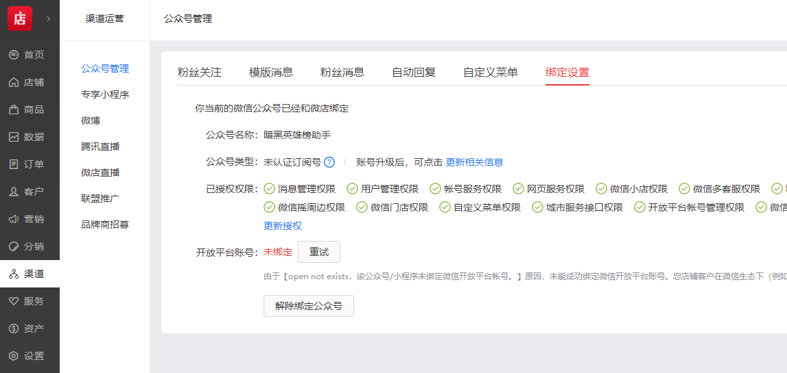

# 微信开店调查报告

## 基本逻辑
微信方面提供入口，真正的店铺是第三方服务器接入。

## 微信方面
可以选择公众号或是小程序来提供入口。在微信看来，开店只是众多三方服务的一种。微信本身不提供服务本身，第三方服务器架设是必须的。

## 店铺主体
可以选择自主开发店铺网站，也可以选择市面上已经有的服务。
自主开发成本很大，如果不是大店基本不用想了。
已有的服务中，【微店】是其中比较知名的一个，其投资方里有腾讯，所以官方的背景使得它在接入微信的方式能体现接口的本意，就像一个官方模板。
其实，像【微店】这样的你可以看作它是你的独立店铺，和微信对接只是一种选择，微信只是他的渠道之一而已。但微信渠道能带来的流量可能是其他方式远远不及的，所以和微信对接实际上也是必须的。

## 和公众号对接
1. 在公众号开启开发模式
2. 在微店选择绑定公众号，进行一系列验证

之后微店就等于是开发模式下的后台了，他接管了所有的api对接。

`对接成功后 -- 公众号界面`

`对接成功后 -- 微店界面`
  

## 和小程序对接
其实逻辑是类似，平台什么都帮你做好了，就是等着收费。

## kintone相关
我们原本想象的kintone作为微信开店的后台，现在看来是及其不可能的。
第一，kintone不是自架服务器，不能按照api要求返回http请求，不可能和微信开发模式对接。技术上已经否定了。
第二，开店的逻辑也是相当繁杂，和已经有的服务相比，根本没有性价比可言。

所以我们后来想的整合各个平台店铺等是相对比较现实的方案。
担心的一点是，各相关平台的数据导出能力较弱，不过设计行业方案不必关心真正实现，所以暂时不造成影响。

