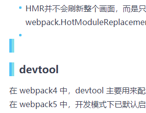

# 9篇文章review笔记

## 建议

### 1 
`episode2`
 > 在项目根目录新建 .editorconfig 或者
 
 还有一个更方便的是指鼠标右键点目录区，然后选 generate .editorconfig。比newfile打字，或叫出命令更快。

 ### 2
 `episode4`
> 如果不喜欢配置ssl证书的，推荐使用 kintone-customize-uploader 方案

可以加上链接方便读者了解什么是 kintone-customize-uploader

https://cybozudev.kf5.com/hc/kb/article/1410280/

### 3
`episode4`

> `npm i webpack-dev-server@next -D`
容易误导？

### 4
`episode5`

> sourceMap：生产环境关闭，开发环境开启

加一个【**下**】字可能更加不容易理解偏误

### 5
`episode7`

开篇无空行，或者一个简洁的标题加以隔断，另外JS标题下空挡过大

 ## 笔误

 ### 1 
`episode2`
> 打开命令面板，输入 Generate .editorcofig

config少**n**

### 2
`episode4`
··········screen shot··············

···············end screen shot····················
存在2个空白的条目

### 3
> CSS

下方多空行

### 4
`episode7`
`episode8`
> `npm i react react-dom -S`

-S 不需要，据说npm 5.0以后就自动save了

## 疑惑
### 1
`episode2`
> npm i prettier -D

vs插件和安装库各自什么作用？两者都需要？同一家人家的？

同理

> npm i eslint -D

### 2
`episode2`
> `ignoreFiles: ['node_modules/**/*', 'dist/**/*'],`

[**]的意思?

### 3
`episode2`
> { display: inline; width: 100px; }

自动修正后还是有错, 最前面会产生一个空格

###
`episode7`

> `npx browserslist ">0.2%, not dead, ie >= 11, not op_mini all"`

没显示什么信息？
